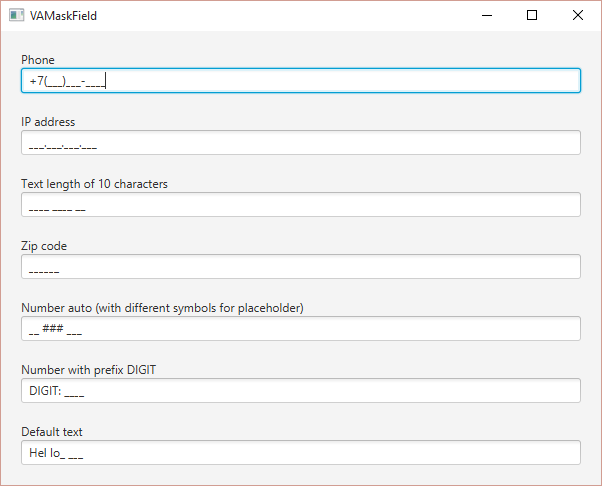

# VAMaskField
VAMaskField this extension TextField for JavaFX.



#Using
Add MaskField.java into your project.
Add the fxml file 

```fxml
  <MaskField />
```


Visit [my blog](http://vas7n.ru) for more information!
